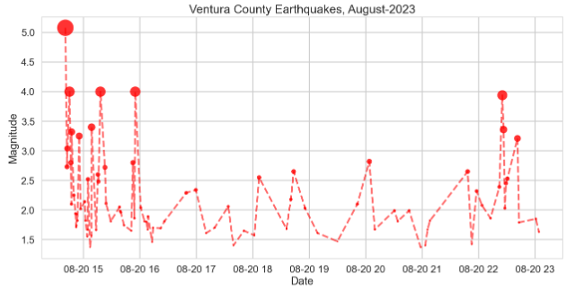
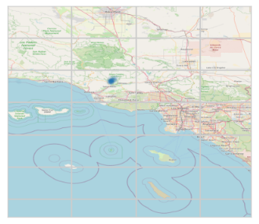

# Seismic-Time-Series-Obspy-Contextily
Clean example of getting seismic data from Obspy and generating map with Contextily.

There was a magnitude 5.1 earthquake near Ojai, California on August 20, 2023, at 2:41 PM PDT, followed by a number of aftershocks in the area. 

The epicenter was located 4.3 miles southeast of Ojai, California, and 10 miles northeast of Ventura. 

The Ojai earthquake occurred along the Sisar fault system, a little known fault located in the mountains above Ojai. It is believed that the fault is capable of producing earthquakes up to magnitude 7.0.

In this notebook the Ojai earthquake event is visualized as a seismic time series using the Obspy Python library to get up-to-the-minute seismic data from Ventura County in California.

Obspy provides convenient access to seismic data along with other significant funcionalities:

* Primary Functionality: Reading and writing of seismological data formats (e.g., SEED, SAC, miniSEED, and others). UTCDateTime: A class for handling time information in a precise manner. Stream and Trace objects for continuous and discrete time series data.

* Signal Processing: Filtering (bandpass, lowpass, highpass, etc.). Instrument correction (remove instrument response from data). Spectrogram plotting, frequency analysis. Picking, triggering, and various detection algorithms. 

* Seismological Database Access: Interfaces to fetch data from a range of online repositories like FDSN webservices, IRIS, and others.

* Event Metadata: Read, write, and handle event metadata, such as catalogs, events, picks, origins, and magnitudes.

* Instrument Responses: Fetch and handle instrument responses, allowing for the correction of seismograms.

* Visualization: Built-in utilities for visualizing seismic data and event metadata, including waveform plotting, section plots, and beachball diagrams.

* Geodetic Utilities: Calculate distances, azimuths, and local magnitudes based on station and event coordinates.

* Interoperability: ObsPy can easily integrate with other scientific Python libraries like NumPy, SciPy, Matplotlib, and Pandas. This facilitates complex data analysis and visualization workflows.

* Extensibility: ObsPy is open-source, so researchers and developers can extend its capabilities or integrate it into their own projects.

* Community and Documentation: Due to its popularity in the seismological community, ObsPy has extensive documentation, tutorials, and an active community that contributes to its development and provides support.

ObsPy provides a comprehensive toolkit for seismologists, researchers, and students, allowing for the efficient processing, analysis, and visualization of seismological data using Python.

The Contextily library was used to generate maps for geo-visualization of the Ojai earthquake sequence. 

The Contextily package facilitates the visualization of geospatial data by fetching and rendering basemaps from tile providers. These can be used as backdrops in maps created with packages like matplotlib or geopandas.
